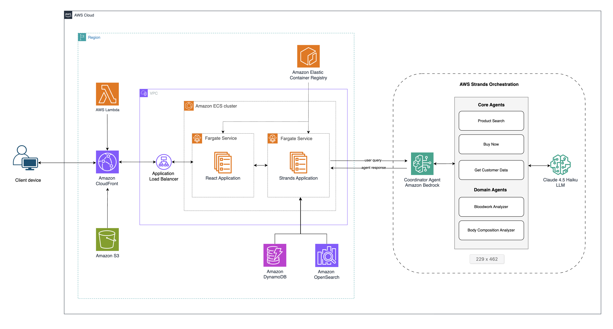

# Guidance for Building Agentic AI-Powered Hyper-Personalized Customer Experience on AWS

## Table of Contents

### Required

1. [Overview](#overview)
    - [Cost](#cost)
2. [Prerequisites](#prerequisites)
    - [Operating System](#operating-system)
3. [Deployment Steps](#deployment-steps)
4. [Deployment Validation](#deployment-validation)
5. [Running the Guidance](#running-the-guidance)
6. [Next Steps](#next-steps)
7. [Cleanup](#cleanup)
8. [Notices](#notices)
9. [Security](#security)
10. [License](#license)

***Optional***

11. [FAQ, known issues, additional considerations, and limitations](#faq-known-issues-additional-considerations-and-limitations)
12. [Revisions](#revisions)
13. [Authors](#authors)

## Overview

The CX Hyper Personalization is an AI-powered product recommendation platform providing personalized product suggestions based on customer profiles and intelligent search. Built for healthcare retail, the multi-agent AI capabilities translate to other industries like Automotive and Retail CPG.

 
 

### Cost

_You are responsible for the cost of the AWS services used while running this Guidance. As of September 2025, the cost for running this Guidance with the default settings in the US East (N. Virginia) Region is approximately **$2,117.76** per month._

_We recommend creating a [Budget](https://docs.aws.amazon.com/cost-management/latest/userguide/budgets-managing-costs.html) through [AWS Cost Explorer](https://aws.amazon.com/aws-cost-management/aws-cost-explorer/) to help manage costs. Prices are subject to change. For full details, refer to the pricing webpage for each AWS service used in this Guidance._

### Sample Cost Table

The following table provides a sample cost breakdown for deploying this Guidance with the default parameters in the US East (N. Virginia) Region for one month.

| AWS service  | Dimensions | Cost [USD] |
| ----------- | ------------ | ------------ |
| AWS Fargate | Frontend: 2 tasks, 4GB memory, 20GB storage, 24hr duration | $115.33 |
| AWS Fargate | Backend: 2 tasks, 4GB memory, 20GB storage, 24hr duration | $115.33 |
| Amazon DynamoDB | 3 tables, 3GB storage, 1KB avg item size | $1.12 |
| Amazon OpenSearch Service | 3 m6g.large.search nodes, 60GB gp3 storage per node | $567.96 |
| Amazon Bedrock | 15 requests/min, 18 hrs/day, 200 input/100 output tokens | $1,020.60 |
| Amazon S3 | 2GB storage, 100 requests, 100GB data transfer | $9.05 |
| Amazon CloudFront | 100GB data transfer, 100K HTTPS requests | $57.25 |
| Elastic Load Balancing | 1 Application Load Balancer | $22.47 |
| Amazon VPC | 1 NAT Gateway, data transfer | $125.30 |
| Amazon CloudWatch | 50 metrics, 60GB logs, 1 dashboard | $83.35 |
| **Total** | | **$2,117.76** |

## Prerequisites

### Operating System

These deployment instructions are optimized to best work on **macOS, Linux, or Windows with WSL**. Deployment in another OS may require additional steps.

**Required:**
- Node.js 20+
- Python 3.11+
- AWS CLI
- Docker
- Git

### AWS account requirements

- Amazon Bedrock model access (Claude, Titan Embeddings)
- Sufficient service limits for ECS Fargate, OpenSearch, and DynamoDB

### aws cdk bootstrap

This Guidance uses AWS CDK. If you are using AWS CDK for the first time, bootstrap your environment:

bash
cdk bootstrap aws://ACCOUNT-ID/REGION

### Supported Regions

This Guidance is optimized for **US East (N. Virginia) - us-east-1**. It can be deployed to other regions where Amazon Bedrock and Amazon OpenSearch Service are available.

### Security Disclaimer 

The application deployed by this guidance is publicly accessible without authentication. This means:
- Anyone with the CloudFront distribution URL can access your application
- Customer profiles and product recommendations are not protected by login requirements. Login profiles are simulated to demonstrate hyper-personalized recommendations based on synthetic user data
- The application is intended for demonstration purposes only
- **For production use, you must implement proper authentication and authorization (e.g., Amazon Cognito)**

## Deployment Steps

#### Step 1: Deploy CDK Infrastructure (20 min)
```bash
cd infrastructure
npm i
cdk deploy
```

> If you get a 403 error while trying to build the Docker image, run this command: `aws ecr-public get-login-password --region us-east-1 | docker login --username AWS --password-stdin public.ecr.aws`

#### Step 2: Configure Environment Variables for AI Service 

- Find the CDK outputs (directly from the CLI or in the AWS CloudFormation console)
- Find the values for **AwsRegion**, **OpenSearchDomainEndpoint**, and **ReactUrl**
- In your IDE, open the .env file inside of the **strands/** folder
- Update the following values: 
    - AWS REGION ... copy/paste **AwsRegion** from CDK output  
    - OPENSEARCH_ENDPOINT ... copy/paste **OpenSearchDomainEndpoint** from CDK output 
    - CORS_ORIGINS ... copy/paste **ReactUrl** value from CDK output 
    - DOMAIN_AGENTS
      - Here you can select which domain specialist agents you want to enable. 
      - This repository has domain specialists built for Healthcare & Automotive as examples. 
      - The frontend is built so for Healthcare, so copy/paste **bloodwork_analyzer,body_composition_analyzer** into this field
    - save the updated **.env** file

#### Step 3: Re-deploy CDK stack (5 min)
```bash
cdk deploy
```

#### Step 4: Load Product Catalog & Customer Profiles (3 min)
```bash
cd ../scripts
python3 opensearch_catalog_load.py
```

#### Step 5: Load Product Images to S3 (2 min)

- Find the CDK outputs (directly from the CLI or in the AWS CloudFormation console)
- Find the value for **S3BucketImages**, copy into the command below

```bash
python3 upload_product_images.py --images-dir "../strands/data/product-images/" --bucket-name "cxhyperpersonalizeapp-data-source-{account#}-{region}"
```
- *Upload 53 images to {bucket name}? (y/N)::* **y**

#### Step 6: Open website
- All done! Your application is now ready to use.
- Open the **ReactUrl** on your web browser.
   

## Deployment Validation

1. Open CloudFormation console and verify the stack `InfrastructureStack` shows `CREATE_COMPLETE`.

2. Verify ECS services are running in the Amazon ECS console.

3. Test the API health endpoint:
bash
   curl https://<cloudfront-domain>/health
   
   
   Expected response:
json
   {"status": "healthy", "services": {"dynamodb": "healthy", "opensearch": "healthy", "agentic": "healthy"}}
   

## Running the Guidance

1. Open the CloudFront distribution URL in your browser.

2. Select a customer profile from the dropdown to enable personalized recommendations.

3. **Test Search**: Enter product queries (e.g., "vitamin D") to see keyword, semantic, and hyper-personalized search results.

4. **Use AI Chat**: Navigate to the chat interface, select a customer profile, and ask questions like "What supplements would help with joint pain?"

5. **Expected Output**: Personalized product recommendations based on customer health profiles and AI analysis.

## Next Steps

- Customize AI agents in `strands/agents/` for your use case
- Add authentication with Amazon Cognito
- Adapt for other industries (Automotive, CPG)

## Cleanup

1. Empty the S3 bucket:
bash
   aws s3 rm s3://<bucket-name> --recursive
   

2. Delete the stack:
bash
   cd infrastructure
   cdk destroy
   

3. Verify all resources are deleted in the CloudFormation console.

## Notices

*Customers are responsible for making their own independent assessment of the information in this Guidance. This Guidance: (a) is for informational purposes only, (b) represents AWS current product offerings and practices, which are subject to change without notice, and (c) does not create any commitments or assurances from AWS and its affiliates, suppliers or licensors. AWS products or services are provided "as is" without warranties, representations, or conditions of any kind, whether express or implied. AWS responsibilities and liabilities to its customers are controlled by AWS agreements, and this Guidance is not part of, nor does it modify, any agreement between AWS and its customers.*

## Security

See [CONTRIBUTING](CONTRIBUTING.md#security-issue-notifications) for more information.

## License

This library is licensed under the MIT-0 License. See the LICENSE file.

## FAQ, known issues, additional considerations, and limitations

**Additional considerations**

- Amazon Bedrock charges based on token usage. Monitor costs in production.
- This Guidance demonstrates healthcare recommendations for demonstration only. For production with real patient data, ensure HIPAA compliance.
- The default OpenSearch configuration uses 3 nodes. Scale as needed for production workloads.

For any feedback, questions, or suggestions, please use the [issues tab](https://github.com/aws-solutions-library-samples/guidance-for-building-agentic-ai-powered-hyper-personalized-customer-experience-on-aws/issues).

## Authors

| Name | Contact | LinkedIn |
|------|---------|----------|
| Jerry Tejada | tejjerry@ | [LinkedIn Profile](https://www.linkedin.com/in/jerrytejada/) |
| Ryan Dsilva | rrdsilva@ | [LinkedIn Profile](https://www.linkedin.com/in/ryan-dsilva) |
| Eugene Mu | eugenemu@ | [LinkedIn Profile](https://www.linkedin.com/in/eugenemu) |
